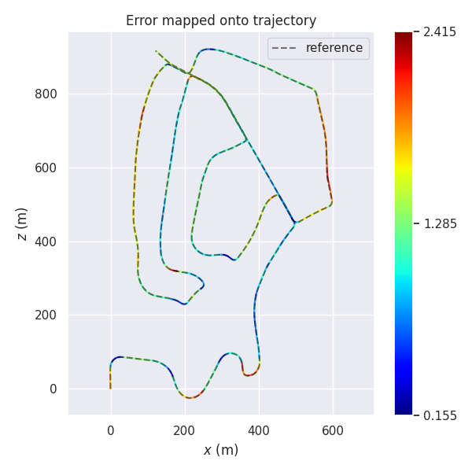
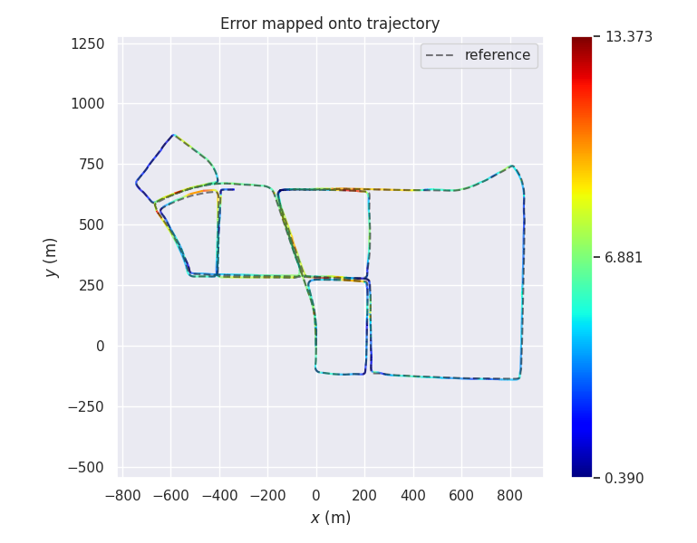

# lvio_fusion

## Introduction

A Self-adaptive Multi-sensor Fusion SLAM Framework Using Actor-critic Method. In 1.0, we built a common framework, and we will focus on the complex environment of vehicles in 2.0. (This is still in development)

```
@misc{jia2021lviofusion,
      title={Lvio-Fusion: A Self-adaptive Multi-sensor Fusion SLAM Framework Using Actor-critic Method}, 
      author={Yupeng Jia and Haiyong Luo and Fang Zhao and Guanlin Jiang and Yuhang Li and Jiaquan Yan and Zhuqing Jiang},
      year={2021},
      eprint={2106.06783},
      archivePrefix={arXiv},
      primaryClass={cs.RO}
}
```

## Dependencies

* ros (Kinetic/Melodic/Noetic)
* Eigen3
* Sophus
* opencv
* pcl
* ceres-solver
* libgeographic-dev

## Usage

Complie:
``` bash
catkin_make
```

Run:
``` bash
source devel/setup.bash
roslaunch lvio_fusion_node kitti.launch
```

## Result

kitti:



kaist urban:


