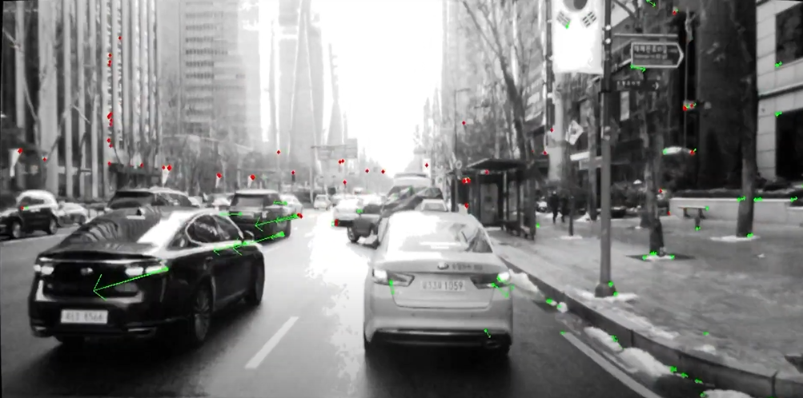

# lvio_fusion

## Introduction

A Self-adaptive Multi-sensor Fusion SLAM Framework Using Actor-critic Method, which focus on the complex environment of vehicles.

Here is the [paper](https://arxiv.org/abs/2106.06783).

```
@misc{jia2021lviofusion,
      title={Lvio-Fusion: A Self-adaptive Multi-sensor Fusion SLAM Framework Using Actor-critic Method}, 
      author={Yupeng Jia and Haiyong Luo and Fang Zhao and Guanlin Jiang and Yuhang Li and Jiaquan Yan and Zhuqing Jiang},
      year={2021},
      eprint={2106.06783},
      archivePrefix={arXiv},
      primaryClass={cs.RO}
}
```

## Dependencies

* ros (Kinetic/Melodic/Noetic)
* Eigen3
* Sophus
* opencv
* pcl
* ceres-solver
* libgeographic-dev

## Usage

Complie:
``` bash
catkin_make
```

Run:
``` bash
source devel/setup.bash
roslaunch lvio_fusion_node kitti.launch
```

## Result

kitti:
To generate rosbags using KITTI raw data, you can use the [script](https://github.com/TixiaoShan/LIO-SAM/tree/master/config/doc/kitti2bag) in lio-sam and the configuration file [kitti2.yaml](https://github.com/jypjypjypjyp/lvio_fusion/blob/main/src/lvio_fusion_node/config/kitti2.yaml)


kaist urban:
Here is a video:
[](https://www.youtube.com/watch?v=y0I2_27AyUE "youtube video")


